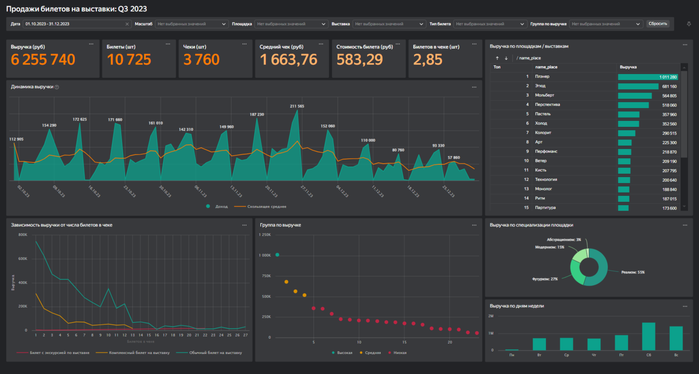

# Дашборд "Выручка – Билеты на выставки – Q3"

## Описание
Дашборд ["Выручка – Билеты на выставки – Q3"](https://datalens.yandex/g9h5s1o94olc2) предоставляет ключевые метрики и аналитику по выручке за билеты на выставки за 3-й квартал 2023 года. Он предназначен для оценки эффективности работы площадок, выявления ключевых точек роста и принятия управленческих решений на основе данных.

## Назначение
Дашборд позволяет:
- Оценить эффективность работы площадок.
- Выявить ключевые точки роста.
- Принять управленческие решения на основе данных.

## Метрики
### Фактические
- **Выручка (руб)**: суммарная выручка от продажи билетов [Цена билета * Кол-во билетов в чеке].
- **Билеты (шт)**: общее количество проданных билетов. 
- **Чеки (шт)**: общее количество оформленных чеков. 
### Расчетные
- **Средний чек (руб)**: средняя сумма одного заказа [Выручка (руб) / Чеки (шт)]
- **Ср. стоимость билета (руб)**: средняя цена одного билета [Выручка (руб) / Билеты (шт)]
- **Ср. билетов в чеке (шт)**: среднее количество билетов в чеке [Билеты (шт) / Чеки (шт)]

#### *Примечание*
*Метрики можно было назвать по общепринятой терминологии. Например, средний чек – AOV, количество позиций в чеке – UPT и так далее. Однако в сфере культуры и искусства такие наименования показателей не распространены.*

## Источники
- Выгрузка продаж из билетной системы за 3-й квартал 2023 г.: формат csv. 
- Справочники бизнес-юнита: формат csv. 

## Планы
- Развернуть ClickHouse в Yandex Cloud и настроить ETL с билетной системой. 
- Подключить DataLens к ClickHouse и перенести расчёты на СУБД.
