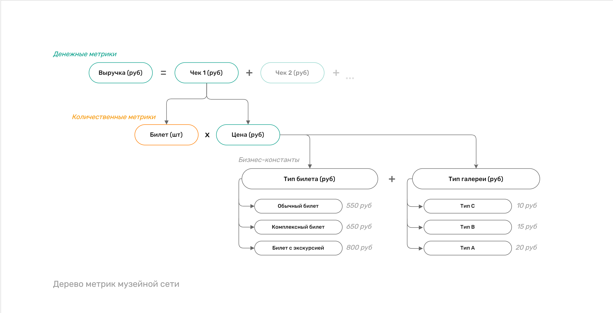

# Разработка дашборда "Продажи билетов на выставки: Q3 2023"

[Дашборд в DataLens](https://datalens.yandex/g9h5s1o94olc2)

&nbsp;
## Техническое описание
 

### Платформа
Дашборд разработан в облачной BI-системе **Yandex DataLens**.

### Источник данных
Для анализа выручки используется **CSV-выгрузка** из билетной системы. Файл загружается напрямую в DataLens.

### Планы по развитию ETL-процесса
В ближайшее время данные будут загружаться через **API** в облачное хранилище **Yandex Object Storage** и подключаться к BI-платформе с использованием **Yandex Query**.
В дальнейшем планируется переход на собственное **DWH** на базе **ClickHouse**.

### Модель данных
Для создания OLAP-куба подготовлены **бизнес-справочники**. Также добавлен **календарь**, который поможет масштабировать аналитику, например, подключать таблицы с плановыми показателями.

### Дополнительно
Для корректного отображения данных в визуализациях добавлены **сортировочные таблицы**, которые обеспечивают правильное упорядочивание строковых значений в соответствии с бизнес-логикой.

&nbsp;
## Метрики

### Фактические
- **Выручка (руб)**: суммарная выручка от продажи билетов [Цена билета * Кол-во билетов в чеке].
- **Чеки (шт)**: общее количество оформленных чеков. 
- **Билеты (шт)**: общее количество проданных билетов. 

### Расчетные
- **Средний чек (руб)**: средняя сумма одного заказа [Выручка (руб) / Чеки (шт)]
- **Ср. стоимость билета (руб)**: средняя цена одного билета [Выручка (руб) / Билеты (шт)]
- **Ср. билетов в чеке (шт)**: среднее количество билетов в чеке [Билеты (шт) / Чеки (шт)]

#### *Примечание*
*Метрики можно было назвать по общепринятой терминологии. Например, средний чек – AOV, количество позиций в чеке – UPT и т.д. Однако в сфере культуры и искусства такие наименования не распространены.*

&nbsp;
## Визуализации
В этом разделе я расскажу о трёх чартах, которые отличаются чуть большей сложностью реализации.
&nbsp;
### Комбинированная диаграмма «Динамика выручки»


Визуализация примечательна тем, что на ней **подписаны только недельные максимумы**. \
Это позволяет менеджменту легко оценить динамику, не отвлекаясь на переключение между осью и точками графика. \
Метки не перегружают визуализацию, оставляя пространство для комфортного восприятия.

На языке Вычисляемых выражений в DataLens это реализовано следующим образом
```sql
IF 
    MAX([sum_value] WITHIN WEEK([datetrunc_date])) = [sum_value] -- Проверка на максимум за неделю
        THEN [sum_value] -- Выводим выручку за день, если это максимум
    ELSE NULL -- Иначе оставляем пустым
END
```

&nbsp;
### Кольцевая диаграмма «Выручка по специализации площадки»


Визуализация примечательна тем, что на ней **составная подпись, которой нет в стандартном наборе DataLens**. \
Такой формат позволяет менеджменту быстро сравнить категории, не отвлекаясь на переключение между легендой и сегментом.

На языке Вычисляемых выражений в DataLens это реализовано следующим образом
```sql
[domain_place] + ": " + STR(ROUND(SUM([value]) / SUM(SUM([value]) TOTAL * 100)) + "%"
```

&nbsp;
### Точечная диаграмма «Группа по выручке»


Визуализация примечательна тем, что для её создания была проведена **[кластеризация по методу k-means](clustering.ipynb)**. \
Менеджменту было важно выделить группы, которые можно определить по размеру выручки. Процентили не подходили, так как этот метод не учитывал сильный разброс точек. \
