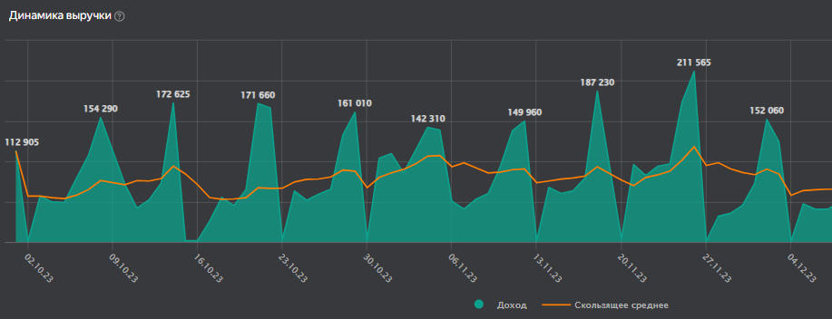
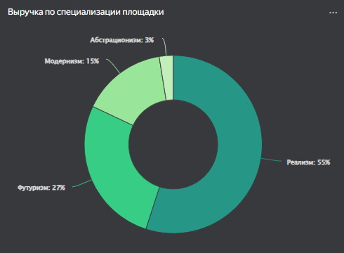

# Разработка дашборда "Продажи билетов на выставки: Q3 2023"

&nbsp;

## Техническое описание
 

### Платформа
Дашборд разработан в облачной BI-системе **Yandex DataLens**.

### Источник данных
Основой для анализа служит выгрузка из билетной системы в формате **CSV**, которая напрямую загружается в DataLens.

### Планы по развитию ETL-процесса
В ближайшее время данные будут загружаться через **API** в облачное хранилище **Yandex Object Storage** и подключаться к DataLens с использованием **Yandex Query**.
В дальнейшем планируется переход на собственное хранилище данных (DWH) на базе **ClickHouse**, что повысит производительность и гибкость работы с данными.

### Модель данных
Для обеспечения масштабируемости аналитики подготовлены **бизнес-справочники** и добавлен **календарь**. Это позволяет легко подключать дополнительные данные, такие как таблицы с плановыми показателями или другими метриками.

### Дополнительно
Для корректного отображения данных в визуализациях добавлены **сортировочные таблицы**, которые обеспечивают правильное упорядочивание строковых значений в соответствии с бизнес-логикой.
&nbsp;


## Метрики

### Фактические
- **Выручка (руб)**: суммарная выручка от продажи билетов [Цена билета * Кол-во билетов в чеке].
- **Чеки (шт)**: общее количество оформленных чеков. 
- **Билеты (шт)**: общее количество проданных билетов. 

### Расчетные
- **Средний чек (руб)**: средняя сумма одного заказа [Выручка (руб) / Чеки (шт)]
- **Ср. стоимость билета (руб)**: средняя цена одного билета [Выручка (руб) / Билеты (шт)]
- **Ср. билетов в чеке (шт)**: среднее количество билетов в чеке [Билеты (шт) / Чеки (шт)]

#### *Примечание*
*Метрики можно было назвать по общепринятой терминологии. Например, средний чек – AOV, количество позиций в чеке – UPT и т.д. Однако в сфере культуры и искусства такие наименования не распространены.*

## Настройка чартов
### Как подписать недельные максимумы на графике

```sql
IF 
    MAX([sum_value] WITHIN WEEK([datetrunc_date])) --Оконка для вычисления максимального дохода за неделю
    = [sum_value] --Сравниваем результат оконки с доходом за день
        THEN [sum_value] --Если совпадет – выводим значение
    ELSE NULL --Если нет – оставляем пустым
END
```

### Как сделать кастомные подписи на кольцевой диаграмме

```sql
[domain_place] --Название специализации
+ ": " 
+ STR( 
    ROUND(
        SUM([value]) / SUM(SUM([value]) TOTAL) * 100 --Доля
        )) 
+ "%"
```

### Как определить кумулятивный итог, топ и квартили для точечной диаграммы


Сначала проранжируем галереи по выручке
```sql
RANK_DENSE(SUM([value]) WITHIN [datetrunc_date]) --используем rank_dense, чтобы не было пропусков
```

Теперь посчитаем накопительный итог
```sql
RSUM([Доля в выручке] ORDER BY [Доля в выручке] ASC)
```

Разделим по квартилям куммулятивный итог
```sql
    IF [w. Кум.дол.итог] <= 0.25 THEN "1"
ELSEIF [w. Кум.дол.итог] <= 0.5 THEN "2"
ELSEIF [w. Кум.дол.итог] <= 0.75 THEN "3"
ELSEIF [w. Кум.дол.итог] <= 1 THEN "4" 
END
```

## Планы
- Развернуть ClickHouse в Yandex Cloud и настроить ETL с билетной системой. 
- Подключить DataLens к ClickHouse и перенести расчёты на СУБД.
